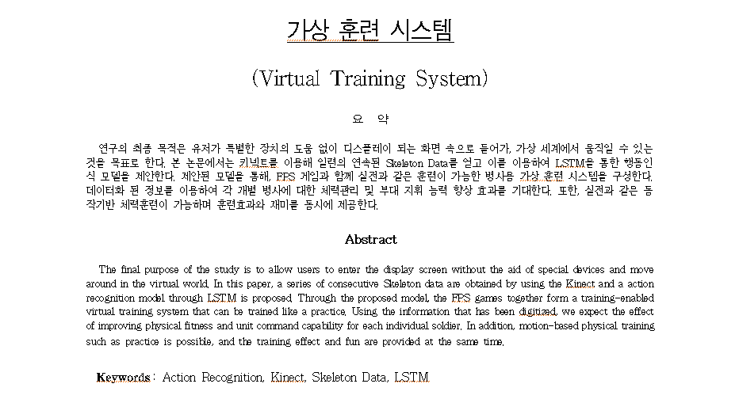
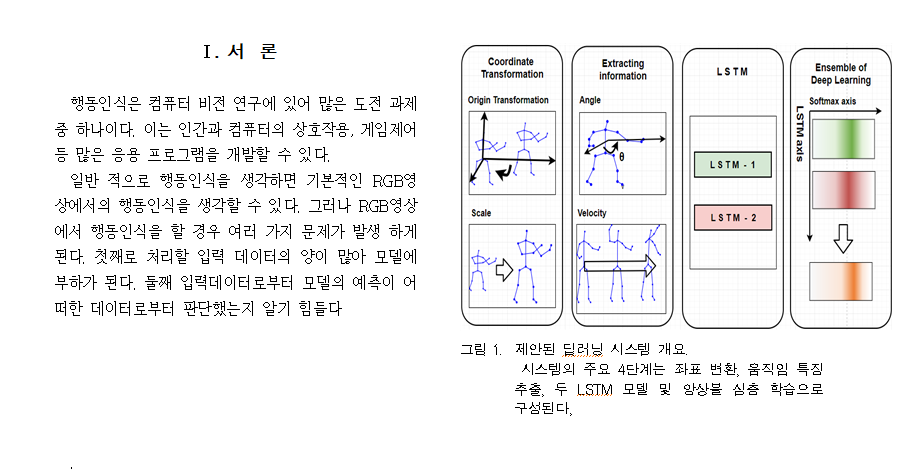
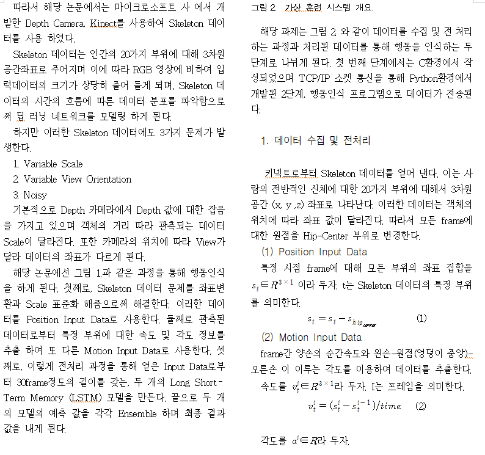
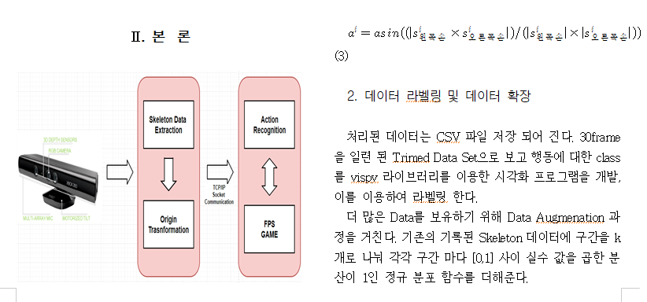
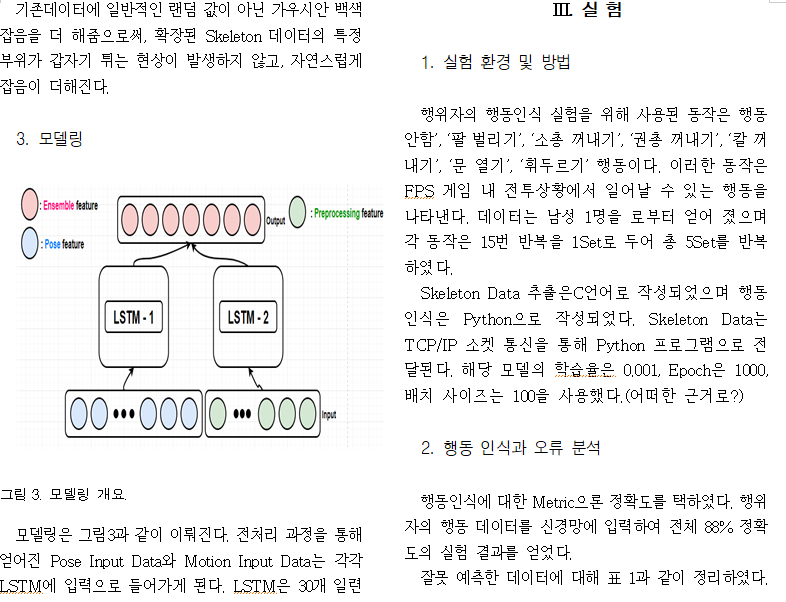
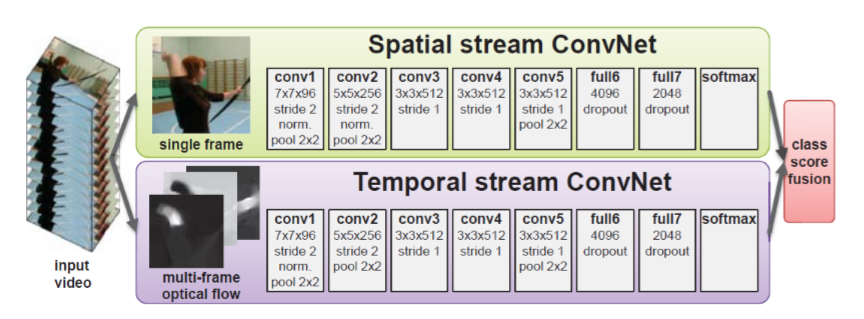
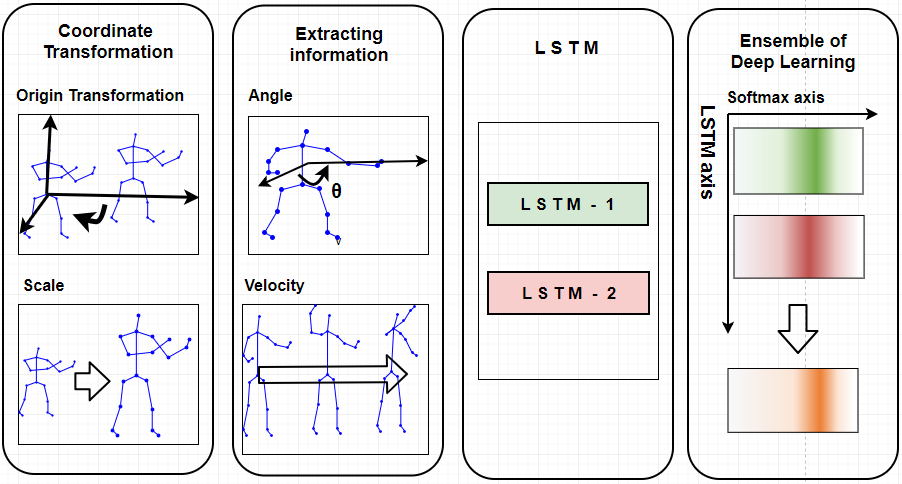
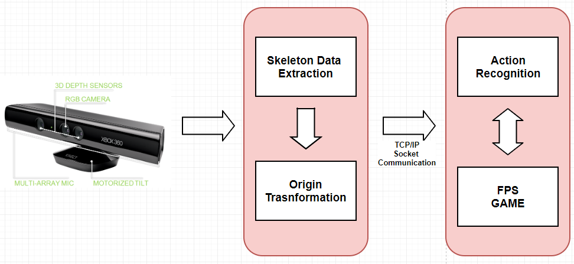
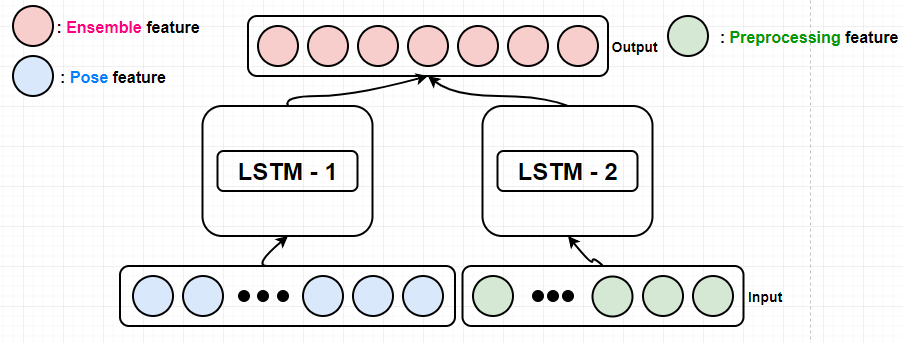

# Virtual Training System with tensorflow

**아래의 내용은 초안으로 작성된 논문형식의 해당 프로젝트 요약본 입니다.**

---

# Virtual Training System with tensorflow

**추가적 센서 부착 없이 실질적인 훈련 시스템**
연구의 최종 목적은 유저가 특별한 장치의 도움 없이 디스플레이 되는 화면 속으로 들어 가  
 가상 세계에서 움직일 수 있는 것을 목표로 한다
FPS 게임과 함께 실전과 같은 훈련이 가능한 병사용 가상훈련  시스템으로 데이터화 된 정보를 이용하여
각 개별 병사에 대한 체력관리와 부대지휘 능력 향상 효과를 기대한다.
또한 실전과 동일한 동작기반 체력훈련이 가능하며 훈련효과와 재미를 동시에 제공하는 효과를 본다.   

## Intro

행동인식 분야에서의 사용되는 카메라 형태
1. **RGB 영상에서의 행동인식**

Two-stream convolutional networks for action recognition in videos, in NIPS 2014
논문에서 UCF-101(88.0%), HMDB-51(59.4%)의 성능을 보여준다
현재는 CVPR 2017에서 UCF-101(94.9%), HMDB-51(72.2%) 성능이 나타난다.

행동인식은 temporal data이기때문에 single frame(spatial stream convnet), apperance
자체를 보기보단 optical flow(temproal stream convnet)라는 것을 이용하여 two-stream
(single frame과 optical flow)으로 가능 형태.

**여기서 중요한점은 행동인식은 대부분 이 two-stream으로 진행되고 있다.**

비디오에서 어떠한 행동을 했는지 맞추는 문제이나 이렇게 맞춰 버리면 맞추기는 했는데
**어떠한걸 근거로 했는지 알수없다.**

만일 행동을 인식할때 context 정보를 이용한다면? 행동을 맞췄을때 그 원인이 어떠한 context
기반으로 만들어 졌는지 알수 있기 때문에 중간 단계를 통해 성능을 올릴 수 있고 분석도 더 잘 되게 된다.

2. **Skeleton data**

RGB에서 2D Skeleton를 open pose라는 오픈소스를 이용하면 쉽게 얻을 수 있다.
3D skeleton data를 사용하게 되면 정보가 2D보다 많기 때문에 행동인식에 도움이 된다
**3D skeleton data를 가지고 행동인식을 주력하고 있다.**

## Issues of Skeleton-based Action Recognition
1. Variable Scale
2. Very Noisy
3. Variable View Orientation
4. attributes of Human action

data의 특징. 기본적으로 depth value가 튀기 때문에 skeleton data는 잡음을 가지며카메라와
 객체의 거리에 따라 scale이 달라진다 또한 카메라 view의 위치에 따라 좌표 값이 달라지는 특성을 가진다.

**attributes of Human action**
Rate Variation : 행동의 temporal 특징으로 행동의 길이가 다양하다 가령 펀치 한 행위를 하는데에도
  한번의 행동이 4frame 이내로 끝나고 다음번에는 6frame으로 끝나는 등

Intra-action Variation : 같은 펀치라도 다른 방식

## Overview of the proposed deep learning network

1. preprocessing : Skeleton을 기반으로한 행동인식의 Issue인 Variable Scale과
Variable View Orientation문제를 해결하기 위해 Scale 표준화 및 원점으로의 좌표 이동을 하였다.

2. modeling :  2가지 LSTM을 사용하여 앙상블을 하였다. 첫번째 LSTM 모델은 pose feautre를
입력으로 가지며 두번쨰 LSTM모델은 손-몸통-손이 이루는 각도, 손의 속도와 같은 정보를
추출하여 입력으로 주었다.

 위와 같이 구성하여 LSTM을 통과한후  softmax classfier에 집어 넣어 결과를 각각 도출 했으며
오른쪽 진하게 칠해진 부분이 각각의 모델들이 어느 class로 매핑하고 있느냐를 의미한다.
이렇게 나온 각 결과를 averaging 하여 서로 보완하는 Ensemble을 행하였다.

## Feature Representation  (!!데이터 전처리 과정 추가 작성 필요)
1. 순전한 kinect skeleton data 사용 : 부하가 너무 커진다.
2. Realative skeleton data : 중심좌표를 선택하여 좌표계 변환(일관성)통해
Variation이 줄어들지만 Jump 같은 행위에 문제가 생긴다.

### Pose orientation alignment

행동에서 다른 방향성으로 가기에 기계가 알기 어렵기 때문에 같은 행동으로 매핑.
매 프레임 마다 Hip_center을 원점으로 좌표계 변환을 하였다. 이로 인해 skeleton의 중심은
항상 원점으로 변하게 된다.
또한 사람의 머리방향을 Y축, 오른쪽에선 왼쪽 HIP으로 가능 방향을 X축, 이를 외적한 Z축 으로 설정
하여 이를 통해 객체가 어디를 바라보고 있는지 파악한다.

### Extracting useful data

해당 과제에서는 행동을안함, 기본자세, 총 꺼내기,권총 꺼내기, 칼 꺼내기, 문열기,
주먹 휘두르기 총 7가지의 행동에 대한 판단을 하게 된다.
이러한 행동은 하체 보다 상체의 움직임 변화가 다양하다. 때문에 이러한 상체의 움직임
변화를 이용하여, 손-몸통-손 과의 각도, 손의 속도 와 같은 정보를 추출하였다.

이러한 모델링은 사람이 행동을 인식할때 형태(pose feature)을 보기도 하고 움직임의 변화
를 보며 판단한다는 직관에 의한 modeling 이다.

## Virtual Training System

   
해당 과제는 다음 이미지와 같은 흐름도를 갖는다.
depth카메라인 키넥트로 부터 Skeleton Data를 추출한후 Skeleton Data를 기반한
행동인식의 Issue들을 해결 하기위에 다양한 전처리 과정을 거치게 된다. 이렇게 처리된 feature
들을 Socket 통신을 통하여 행동을 인식하는 네트워크망을 거쳐 행동을 판단한다.

### Action Recognition modeling

LSTM1은 pose feature 그대로 20개 부위의 skeleton data에서 Hip_center으로 원점변환 후 feature이다.
때문에 Hip_center의 좌표는 항상 (0,0,0) 이기 때문에 이것을 제외한 총 57개의 data가 input으로 들어간다.

LSTM2는 상체 움직임에 중점을 두어 손의 속력, 이루는 각도, 손의 좌표 가 input으로 들어간다.

이러한 data는 총 30개의 frame이 모이게 되면 1개의 set가 되어 입력 feature가 되어지며
1frame이 더 들어올때마다 기존의 큐의 앞부분 가장 늦게 먼저 들어온 frame을 빼어주고 새로운 1개
frame을 큐의 뒷부분에 넣어주며(FIFO) 행동을 판단하므로 1frame 단위 마다 행동을 인식한다.  

### Data augmentation (아래 추가작성 필요)
### Dropout
### Experiment
## Remaining Issues

- Network design : 모델을 더 한다. 파라미터 evaluation을 통해
- Untrimed data : skeleton의 localization 문제가 추가로 발생
- Human poas estimation
